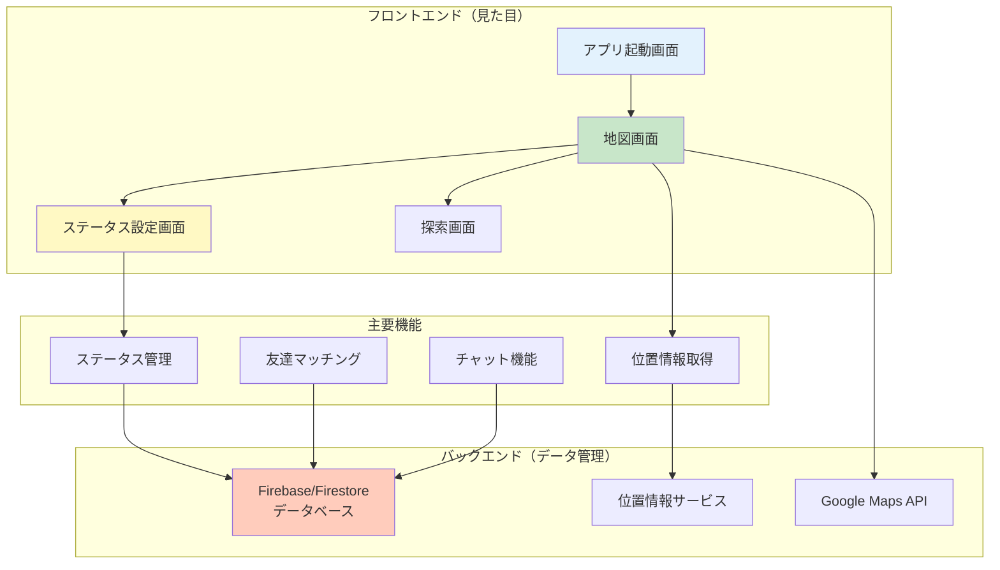
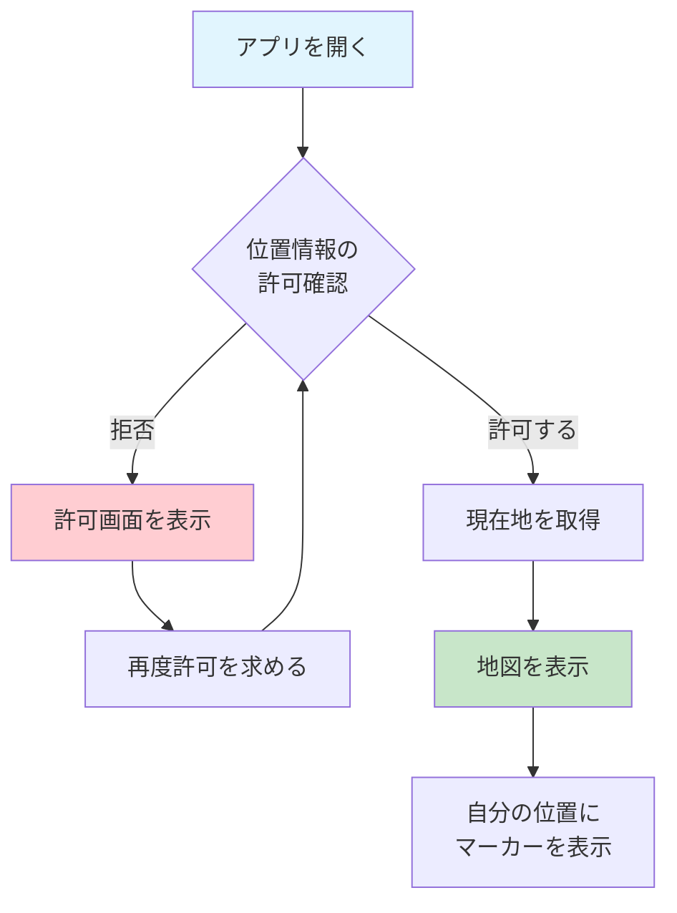
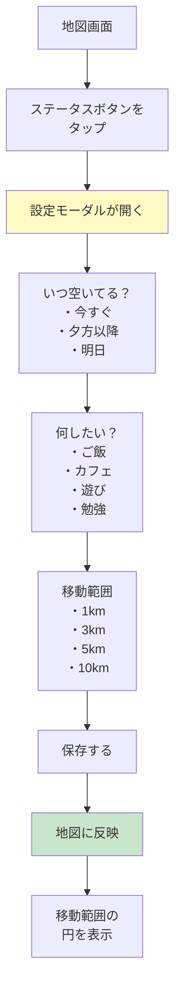
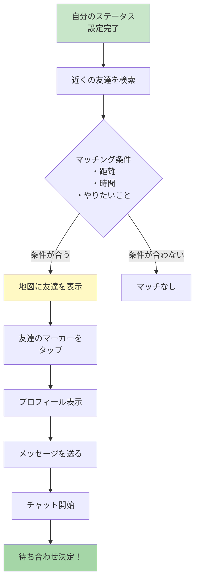
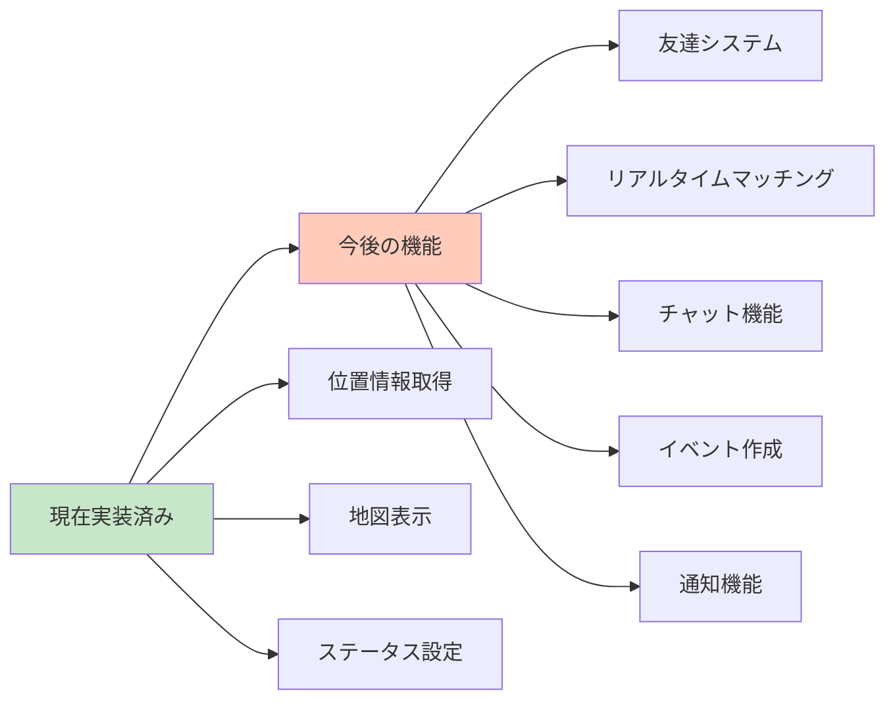

# Collect Friends App ワークフロー図解

## 🎯 アプリの概要

このアプリは、**位置情報を使って近くにいる友達と繋がれるソーシャルアプリ**です。
「今から遊べる？」「明日カフェ行こう」といった、リアルタイムな友達マッチングを実現します。

## 📱 アプリの全体構造



## 🔄 ユーザー操作の流れ

### 1. 初回起動時の流れ



### 2. ステータス設定の流れ



### 3. 友達マッチングの流れ（今後実装予定）



## 🗂️ ファイル構造の説明

```mermaid
graph TD
    Root[collect-friends-app<br/>プロジェクトルート] --> App[app/フォルダ<br/>画面ファイル]
    Root --> Components[components/フォルダ<br/>部品ファイル]
    Root --> Constants[constants/フォルダ<br/>設定ファイル]
    Root --> Hooks[hooks/フォルダ<br/>機能ファイル]
    
    App --> Tabs[(tabs)フォルダ]
    Tabs --> Index[index.tsx<br/>地図画面]
    Tabs --> Explore[explore.tsx<br/>探索画面]
    
    Components --> StatusModal[StatusModal.tsx<br/>ステータス設定]
    Components --> ThemedComponents[ThemedText.tsx<br/>ThemedView.tsx<br/>デザイン部品]
    
    style Root fill:#e3f2fd
    style App fill:#c8e6c9
    style Components fill:#fff9c4
```

## 💡 プログラミング初心者向け解説

### データの流れを理解しよう

1. **ユーザーの操作** → **画面の更新** → **データの保存**
   - 例：ステータスボタンをタップ → モーダルが開く → 設定を保存

2. **外部サービスとの連携**
   - 位置情報：スマホのGPS → アプリ → 地図に表示
   - データ保存：アプリ → Firebase → クラウドに保存

3. **コンポーネント（部品）の考え方**
   - 大きな画面を小さな部品に分割
   - 部品を組み合わせて画面を作る
   - 同じ部品を使い回せる

### 重要な用語

- **コンポーネント**: 画面を構成する部品（ボタン、テキストなど）
- **ステート（状態）**: アプリが覚えておくデータ（位置情報、ステータスなど）
- **API**: 外部サービスと通信するための窓口
- **モーダル**: 画面の上に重なって表示される小窓

## 🚀 今後の実装予定



## 📝 開発のヒント

1. **まずは動くものを作る**
   - 完璧を求めすぎない
   - 小さな機能から始める

2. **ユーザー視点で考える**
   - 使いやすさを重視
   - 直感的な操作

3. **エラーに備える**
   - 位置情報が取得できない場合
   - ネットワークエラー
   - 権限がない場合

このワークフロー図を参考に、アプリの全体像を理解して開発を進めてください！