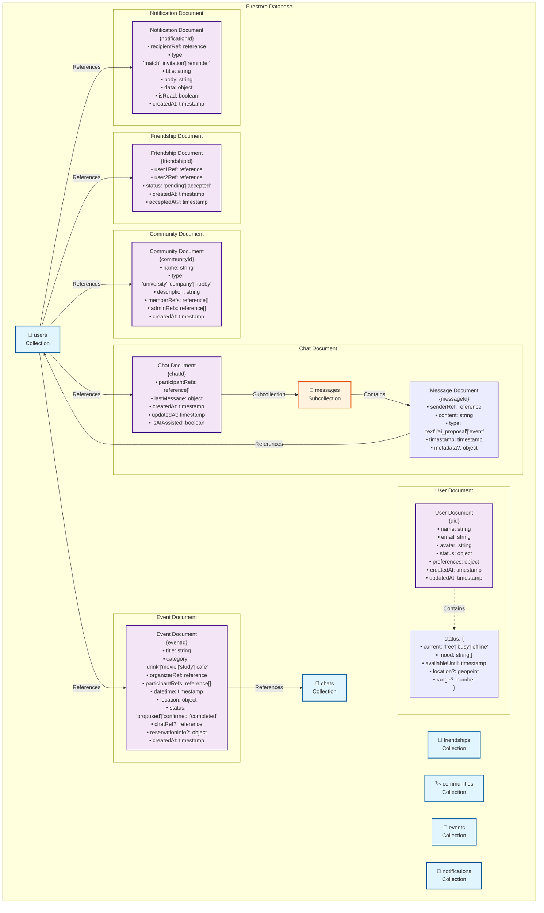

# Correct Friends App - 機能仕様書

## アプリ概要

「今ヒマな人、どこ？」をサクッと解決するAIエージェント搭載のスケジュール調整＆自動予約ツール。

友人同士の空き時間をリアルタイムで把握し、AIが最適な遊びプランを提案して自動予約まで完結するスマートフォンアプリ。

## 主要機能概要

### コアコンセプト
- アプリ内での暇ステータス共有によるマッチング
- AIエージェントによる自動返信・プラン提案・予約
- SNS感覚でのシンプルな友人登録
- チャット形式での直感的なやりとり

## 詳細機能仕様

### 1. ユーザー管理機能

#### 1.1 認証・プロフィール
- **新規登録/ログイン**
  - メールアドレス、電話番号、SNSアカウント連携
  - プロフィール設定（名前、アイコン、自己紹介）
  
- **プロフィール管理**
  - 基本情報編集
  - 趣味・興味カテゴリー設定
  - プライバシー設定

#### 1.2 フレンド管理
- **フレンド追加**
  - QRコード、招待リンク、ユーザー名検索
  - SNS感覚での相互フォロー機能
  
- **フレンドリスト**
  - フレンド一覧表示
  - オンライン状況・暇ステータス表示
  - フレンドのカテゴリー管理

### 2. ステータス管理機能

#### 2.1 暇ステータス設定
- **現在の状況**
  - 「今暇」「後で暇」「忙しい」「オフライン」
  - 期間設定（○時間後まで暇、など）
  
- **気分・やりたいこと**
  - 「飲みたい」「映画見たい」「カフェでまったり」
  - 「勉強会したい」「散歩したい」など
  
- **場所情報**
  - 現在地設定（任意）
  - 移動可能範囲設定

### 3. コミュニティ・タグ機能

#### 3.1 コミュニティタグ
- **タグ登録**
  - 大学、会社、サークル、趣味グループなど
  - 複数タグ所属可能
  
- **タグベースマッチング**
  - 同じタグ内でのステータス共有
  - タグごとの通知設定

### 4. マッチング・提案機能

#### 4.1 AIマッチング
- **自動マッチング**
  - 暇ステータス同士の自動照合
  - 距離、時間、趣味の適合性を考慮
  
- **グループマッチング**
  - 1:1以外の複数人での予定調整
  - コミュニティタグ内での参加者募集

#### 4.2 AIプラン提案
- **カテゴリー別提案**
  - 飲み会: 居酒屋、バー、カフェ
  - 映画: 映画館、配信視聴会
  - 勉強: カフェ、図書館、勉強会
  - アクティビティ: 散歩、スポーツ、ショッピング
  
- **複数プラン提案**
  - 時間帯別の選択肢
  - 予算別の選択肢
  - 場所別の選択肢

### 5. チャット・コミュニケーション機能

#### 5.1 AI応答システム
- **自動返信**
  - ユーザーの代わりにAIが初期応答
  - 都合の良い時間・場所の自動調整
  
- **提案チャット**
  - AIが提案したプランに対する反応
  - 修正・代替案の提示

#### 5.2 ユーザー間チャット
- **プラン調整チャット**
  - 参加者全員でのグループチャット
  - リアルタイムメッセージング
  
- **確認・変更機能**
  - 予定の確認・変更・キャンセル
  - 一言での簡単操作

### 6. 予約・スケジュール機能

#### 6.1 自動予約
- **店舗予約**
  - グルメサイトAPI連携
  - 予約可能店舗の自動検索・予約
  
- **チケット予約**
  - 映画館API連携
  - 座席選択・決済機能

#### 6.2 スケジュール管理
- **予定管理**
  - アプリ内カレンダー表示
  - 予定の自動登録
  
- **リマインダー**
  - 予定前の自動通知
  - 参加確認機能

### 7. 通知機能

#### 7.1 リアルタイム通知
- **マッチング通知**
  - 暇な友人の発見通知
  - おすすめプランの提案通知
  
- **コミュニティ通知**
  - 同じタグメンバーの活動状況
  - グループ募集通知

#### 7.2 予定関連通知
- **予約確認通知**
  - 予約完了・変更・キャンセル
  - 参加者への通知
  
- **当日リマインダー**
  - 開始前の確認通知
  - 遅刻・欠席の連絡機能

## 画面別機能詳細

### ホーム画面
- **現在のステータス表示・変更**
- **暇な友人一覧**
- **おすすめマッチング表示**
- **最近の活動履歴**

### フレンド画面
- **フレンド一覧・ステータス確認**
- **新しいフレンド追加**
- **コミュニティタグ管理**

### チャット画面
- **進行中のチャット一覧**
- **AIとのプラン相談**
- **グループチャット**

### マイページ
- **プロフィール編集**
- **ステータス設定**
- **通知設定**
- **アプリ設定**

### 予定・履歴画面
- **今後の予定一覧**
- **過去の活動履歴**
- **予定の編集・キャンセル**

## 主要ユースケース

### ケース1: 即席飲み会
1. ユーザーが「今飲みたい」ステータスに設定
2. AIが暇な友人を検索・マッチング
3. 複数人でのグループ飲み会を提案
4. 参加者確認後、自動で店舗予約
5. 全員に通知・カレンダー登録

### ケース2: 映画鑑賞
1. 「映画見たい」気分を投稿
2. 同じ映画に興味のある友人とマッチング
3. 上映時間・映画館を提案
4. チケット予約・待ち合わせ場所設定

### ケース3: 勉強会開催
1. コミュニティタグ内で勉強会企画投稿
2. 参加希望者を募集
3. 日時・場所・テーマを調整
4. 会場予約・参加者通知

### ケース4: 急な空き時間活用
1. 急にできた空き時間を「暇」ステータスに
2. 近くにいる友人との簡単な集まりを提案
3. カフェでお茶、散歩など気軽なプランを実行

## 技術的考慮事項

### データベース構成（Firestore）

#### DB構成図

#### 主要コレクション詳細

- **users**: ユーザー情報、リアルタイムステータス
- **friendships**: 友人関係の管理（双方向参照）
- **communities**: コミュニティタグとメンバー管理
- **chats**: チャットルーム（messagesサブコレクション含む）
- **events**: 予定・イベント情報
- **notifications**: 通知履歴

#### Firestoreの設計原則

- **非正規化**: よく一緒に読み取られるデータは同じドキュメントに格納
- **DocumentReference**: ドキュメント間の関係は参照で管理
- **サブコレクション**: メッセージなど親子関係の明確なデータに使用
- **複合インデックス**: クエリパフォーマンス向上のため適切なインデックス設計
- **セキュリティルール**: ユーザー権限に基づくデータアクセス制御

### セキュリティ・プライバシー
- 位置情報の適切な管理
- フレンド以外からの非表示設定
- データの暗号化
- 適切な認証・認可

### パフォーマンス
- リアルタイム更新の最適化
- 画像・データのキャッシュ戦略
- オフライン対応
- プッシュ通知の効率化
