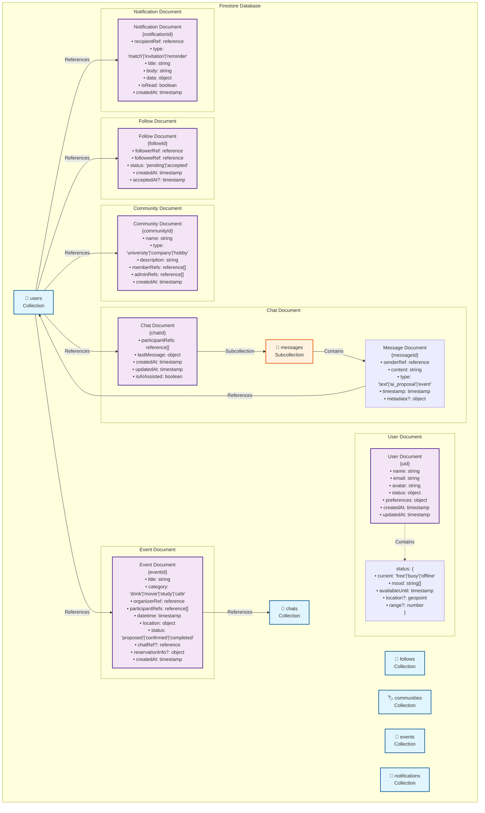

# Correct Friends App - 機能仕様書

## アプリ概要

「今すぐ遊べる人、近くにいない？」をサクッと解決する位置情報ベースの友達同士の即日集まりアプリ。

フットワークが軽い友達同士をリアルタイムで繋げ、「今日暇だな」「明日時間できた」という即日・翌日のニーズに特化したフォロー型SNS＆自動提案アプリ。

## 主要機能概要

### コアコンセプト
- 位置情報ベースの即日友達集まり（今日・明日限定）
- フットワークの軽い友達同士の迅速な繋がり
- 地図上での暇ステータス可視化
- 30分〜3時間程度のライトな集まりに特化
- フォロー・フォロワー関係での安心・安全な友達交流
- 友達の友達まで繋がれるネットワーク拡張

## 詳細機能仕様

### 1. ユーザー管理機能

#### 1.1 認証・プロフィール
- **新規登録/ログイン**
  - メールアドレス、電話番号、SNSアカウント連携
  - プロフィール設定（名前、アイコン、自己紹介）
  
- **プロフィール管理**
  - 基本情報編集
  - 趣味・興味カテゴリー設定
  - プライバシー設定

#### 1.2 フォロー・フォロワー管理
- **フォロー機能**
  - QRコード、招待リンク、ユーザー名検索
  - SNS感覚での相互フォロー機能
  - 友達の友達表示・フォロー提案
  
- **フォロワーリスト**
  - フォロワー・フォロイー一覧表示
  - オンライン状況・暇ステータス表示
  - フォロワーのカテゴリー管理
  - 友達の友達ネットワーク表示

### 2. ステータス管理機能

#### 2.1 即日暇ステータス設定
- **今日・明日の空き状況**
  - 「今すぐ暇」「夕方から暇」「明日午前中暇」「明日夕方から暇」
  - 具体的な時間帯設定（2-3時間区切り）
  
- **やりたいこと（即日向け）**
  - 「お茶・カフェ」「軽く飲み」「散歩・ぶらぶら」
  - 「買い物・ショッピング」「映画」「軽食・ランチ」
  
- **位置情報・移動範囲**
  - 現在地自動取得
  - 移動可能距離設定（徒歩15分、電車30分、車1時間など）
  - 待ち合わせ希望エリア設定

### 3. コミュニティ・タグ機能

#### 3.1 コミュニティタグ
- **タグ登録**
  - 大学、会社、サークル、趣味グループなど
  - 複数タグ所属可能
  
- **タグベースフォロー**
  - 同じタグ内でのフォロー促進
  - タグごとの友達・ステータス共有
  - タグごとの通知設定

### 4. 友達検索・提案機能

#### 4.1 位置情報ベース友達検索
- **地図上での友達表示**
  - 指定範囲内の暇なフォロワー表示
  - リアルタイム位置情報更新
  - 距離・時間・やりたいことの一致度を考慮
  
- **即日集まり提案**
  - 今日中の予定に限定
  - 明日の予定は前日夜まで
  - フォロワー同士での迅速なやりとり

#### 4.2 AIライトプラン提案
- **近場のライト提案**
  - カフェ: 近くのおしゃれカフェ、チェーン店
  - 軽飲み: カジュアルな居酒屋、バー
  - 散歩: 公園、商店街、話題のスポット
  - ショッピング: 近くのモール、商業施設
  
- **即日実行可能な提案**
  - 予約不要・当日OKの店舗優先
  - 待ち時間・移動時間を最小化
  - 1-3時間程度の短時間プラン

### 5. チャット・コミュニケーション機能

#### 5.1 AI応答システム
- **自動返信**
  - ユーザーの代わりにAIが初期応答
  - 都合の良い時間・場所の自動調整
  
- **提案チャット**
  - AIが提案したプランに対する反応
  - 修正・代替案の提示

#### 5.2 ユーザー間チャット
- **プラン調整チャット**
  - 参加者全員でのグループチャット
  - リアルタイムメッセージング
  
- **確認・変更機能**
  - 予定の確認・変更・キャンセル
  - 一言での簡単操作

### 6. 予約・スケジュール機能

#### 6.1 自動予約
- **店舗予約**
  - グルメサイトAPI連携
  - 予約可能店舗の自動検索・予約
  
- **チケット予約**
  - 映画館API連携
  - 座席選択・決済機能

#### 6.2 スケジュール管理
- **予定管理**
  - アプリ内カレンダー表示
  - 予定の自動登録
  
- **リマインダー**
  - 予定前の自動通知
  - 参加確認機能

### 7. 通知機能

#### 7.1 リアルタイム通知
- **友達活動通知**
  - 暇なフォロワーの発見通知
  - おすすめプランの提案通知
  - 友達の友達からのフォロー提案
  
- **コミュニティ通知**
  - 同じタグメンバーの活動状況
  - グループ募集通知

#### 7.2 予定関連通知
- **予約確認通知**
  - 予約完了・変更・キャンセル
  - 参加者への通知
  
- **当日リマインダー**
  - 開始前の確認通知
  - 遅刻・欠席の連絡機能

## 画面別機能詳細

### マップホーム画面（メイン画面）
- **現在地を中心とした地図表示**
- **近くの暇なフォロワーをピンで表示**
- **自分のステータス設定（浮きボタン）**
- **移動範囲の円形表示**
- **フィルター機能（やりたいこと別）**

### フォロワー画面
- **フォロワー・フォロイー一覧・現在ステータス**
- **新しいフォロー追加（QR・ID検索）**
- **友達の友達表示・フォロー提案**
- **位置情報共有設定**
- **コミュニティタグ管理**

### チャット・通知画面
- **アクティブな会話一覧**
- **友達活動通知**
- **迅速な返答（テンプレート）**
- **位置共有チャット**

### プロフィール・設定画面
- **基本プロフィール情報**
- **即日ステータス設定**
- **位置情報・プライバシー設定**
- **通知設定**

## 主要ユースケース

### ケース1: 今すぐカフェでお茶
1. 「今すぐ暇・カフェでお茶したい」ステータス設定
2. 徒歩15分圏内の暇なフォロワーをマップで確認
3. 相手に通知送信・30分以内に返答
4. 中間地点のカフェをAI提案
5. 簡単な挨拶後、1-2時間のお茶タイム

### ケース2: 夕方から軽く飲み
1. 15時頃「夕方から軽く飲みたい」投稿
2. 近くの暇なフォロワー2-3人に通知
3. 18-19時開始で予約不要の居酒屋提案
4. グループチャットで簡単調整
5. 当日夕方に実行

### ケース3: 急な買い物同行
1. 「買い物付き合ってくれる人いない？」投稿
2. ショッピング好きのフォロワーに通知
3. 最寄りの商業施設・モールを提案
4. 待ち合わせ場所と時間を決定
5. 2-3時間の買い物タイム

### ケース4: 散歩・ぶらぶら
1. 天気の良い日に「散歩したい」ステータス設定
2. 近くの公園・商店街エリアのフォロワー検索
3. 共通の行きたい場所で合流相談
4. 気軽に合流・1時間程度の散歩
5. 解散も気軽にできるライトな交流

## 技術的考慮事項

### データベース構成（Firestore）

#### DB構成図

#### 主要コレクション詳細

- **users**: ユーザー情報、リアルタイムステータス
- **follows**: フォロー・フォロワー関係の管理
- **communities**: コミュニティタグとメンバー管理
- **chats**: チャットルーム（messagesサブコレクション含む）
- **events**: 予定・イベント情報
- **notifications**: 通知履歴

#### Firestoreの設計原則

- **非正規化**: よく一緒に読み取られるデータは同じドキュメントに格納
- **DocumentReference**: ドキュメント間の関係は参照で管理
- **サブコレクション**: メッセージなど親子関係の明確なデータに使用
- **複合インデックス**: クエリパフォーマンス向上のため適切なインデックス設計
- **セキュリティルール**: ユーザー権限に基づくデータアクセス制御

### セキュリティ・プライバシー
- 位置情報の適切な管理
- フレンド以外からの非表示設定
- データの暗号化
- 適切な認証・認可

### パフォーマンス
- リアルタイム更新の最適化
- 画像・データのキャッシュ戦略
- オフライン対応
- プッシュ通知の効率化
