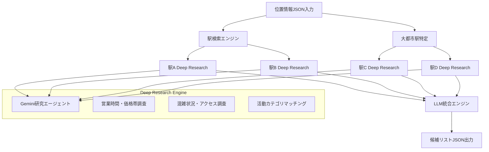

## 📋 **位置情報ベースアクティビティ推奨システム FastAPI仕様書**

### 🎯 **システム概要**

位置情報とユーザーの状況（人数・気分）を基に、Gemini研究エージェントを活用して最適なアクティビティ候補を提案するシステム

### 🏗️ **システムアーキテクチャ**



### 🔧 **API仕様**

#### **1. メインエンドポイント**

```python
POST /api/v1/activity-recommendations
```

**リクエスト仕様:**
```json
{
  "user_location": {
    "latitude": 35.6762,
    "longitude": 139.6503,
    "accuracy": 10
  },
  "group_info": {
    "member_count": 3,
    "member_moods": ["お茶・カフェ", "散歩・ぶらぶら"],
    "budget_range": "low|medium|high",
    "duration_hours": 2.5
  },
  "preferences": {
    "search_radius_km": 10,
    "max_stations": 20,
    "activity_types": ["お茶・カフェ", "軽く飲み", "散歩・ぶらぶら", "買い物・ショッピング", "映画", "軽食・ランチ"],
    "exclude_crowded": false
  },
  "context": {
    "current_time": "2025-06-28T20:30:00+09:00",
    "weather_consideration": true,
    "accessibility_needs": []
  }
}
```

**レスポンス仕様:**
```json
{
  "success": true,
  "request_id": "req_12345",
  "processing_time_ms": 15230,
  "recommendations": [
    {
      "rank": 1,
      "station_info": {
        "name": "渋谷駅",
        "lines": ["JR山手線", "東急東横線", "京王井の頭線"],
        "distance_from_user_m": 2300,
        "travel_time_min": 8
      },
      "activities": [
        {
          "category": "お茶・カフェ",
          "venues": [
            {
              "name": "スターバックス渋谷スクランブル店",
              "rating": 4.2,
              "price_range": "¥500-1500",
              "crowd_level": "medium",
              "operating_hours": "07:00-23:00",
              "walking_time_min": 3,
              "special_features": ["眺望良好", "WiFi完備"],
              "real_time_info": "現在空席あり"
            }
          ]
        }
      ],
      "overall_score": 8.7,
      "recommendation_reason": "グループの気分「お茶・カフェ」「散歩・ぶらぶら」に最適。渋谷は多様な選択肢があり、人数3名に適した店舗が豊富。",
      "estimated_total_cost": "¥1500-4500",
      "weather_suitability": "雨天でも屋内施設充実"
    }
  ],
  "research_metadata": {
    "stations_analyzed": 12,
    "venues_researched": 156,
    "research_loops_executed": 3,
    "data_sources": ["Google Places", "ぐるなび", "食べログ", "リアルタイム混雑API"]
  }
}
```

### 🏛️ **データモデル**

```python
from pydantic import BaseModel
from typing import List, Optional
from enum import Enum

class ActivityType(str, Enum):
    CAFE = "お茶・カフェ"
    DRINK = "軽く飲み"
    WALK = "散歩・ぶらぶら"
    SHOPPING = "買い物・ショッピング"
    MOVIE = "映画"
    FOOD = "軽食・ランチ"

class BudgetRange(str, Enum):
    LOW = "low"      # ～¥1000/人
    MEDIUM = "medium"  # ¥1000-3000/人
    HIGH = "high"    # ¥3000～/人

class LocationData(BaseModel):
    latitude: float
    longitude: float
    accuracy: Optional[float] = None

class GroupInfo(BaseModel):
    member_count: int
    member_moods: List[ActivityType]
    budget_range: BudgetRange
    duration_hours: float
```

### 🔧 **Deep Research Engine仕様**

#### **研究クエリテンプレート**

```python
RESEARCH_PROMPT_TEMPLATE = """
駅名: {station_name}
人数: {member_count}名
希望活動: {activity_types}
予算: {budget_range}
時間: {current_time}

以下の情報を詳細に調査してください：

1. 営業時間・定休日情報
2. 価格帯・コストパフォーマンス
3. 現在の混雑状況・待ち時間
4. アクセス方法・徒歩時間
5. {member_count}名グループに適した店舗・施設
6. 雨天時の対応可能性
7. リアルタイムの特別情報（イベント、セール等）

調査対象カテゴリ: {activity_types}
重点調査項目: グループサイズ{member_count}名に最適な選択肢
"""
```

### 🌍 **大都市リスト定義**

```python
MAJOR_CITIES = {
    "関東": ["新宿", "渋谷", "池袋", "品川", "東京", "上野", "浅草", "横浜", "川崎", "大宮"],
    "関西": ["大阪", "梅田", "難波", "天王寺", "京都", "神戸", "三宮"],
    "中部": ["名古屋", "栄", "金山", "静岡", "浜松"],
    "九州": ["博多", "天神", "小倉", "熊本", "鹿児島"]
}
```

### ⚙️ **環境変数設定**

```env
# Gemini API
GEMINI_API_KEY=your_gemini_api_key

# 検索設定
DEFAULT_SEARCH_RADIUS_KM=10
MAX_STATIONS_PER_REQUEST=20
MAX_RESEARCH_LOOPS=3

# 外部API
GOOGLE_PLACES_API_KEY=your_google_places_key
GURUNAVI_ACCESS_KEY=your_gurunavi_key
TABELOG_API_KEY=your_tabelog_key

# Redis（キャッシュ）
REDIS_URL=redis://localhost:6379

# 並列処理
MAX_CONCURRENT_RESEARCH=4
RESEARCH_TIMEOUT_SECONDS=30
```

この仕様書に基づいて、既存のcollect-friends-appに新しいマイクロサービスとして統合することで、高度な位置情報ベース推奨システムを実現できます。